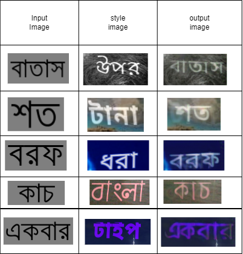

# Bangla Scene Text Editing (STE) system

Numerous vision-based applications require the use of text because it gives rich and precise information. The Bangla Scene-Text-Editing (STE) system is a technology that provides a means of editing text in natural images or modifying words in images while still maintaining the image’s authenticity. This is a tough process, as both the background and font styles must be retained such that the altered image is visually identical to the source image. The Bangla Scene-Text-Editing (STE) system is made up of three parts: the text conversion module, the background inpainting module, and the fusion module, which are all available. They work together to make an end-to-end system. This component modifies the text in the source image with the text in the targeted text while preserving the source image's original text style. The background inpainting module removes the text and replaces it with a texture that looks like the text area. The Fusion module brings together the information from the two previous modules and makes the altered text pictures that were made before. This is the very first attempt, as far as we aware, to change Bengali text in natural pictures at the word level, and it represents a significant milestone. On a synthetic dataset, both visually effective and quantitative findings were observed.

<b><i>Sample generated results from our Bangla STE model.</i></b>

  

